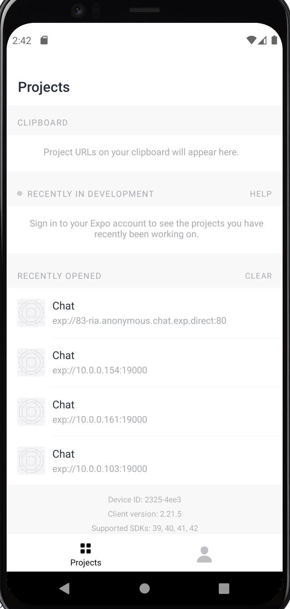
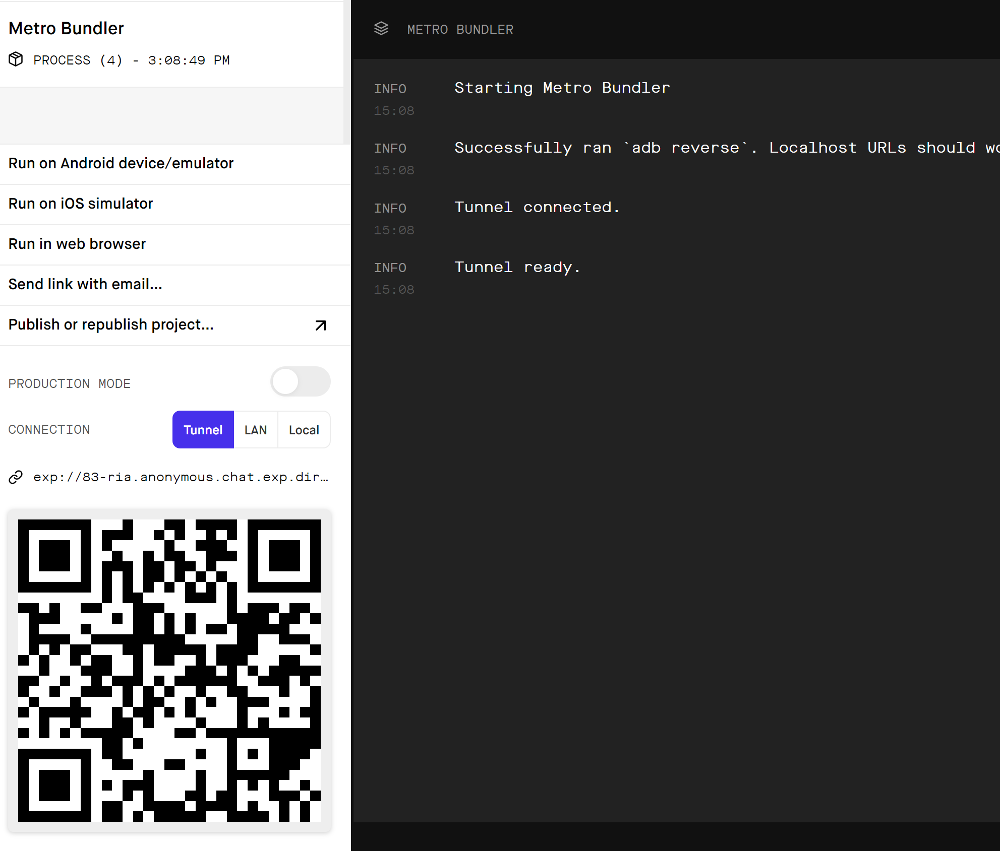
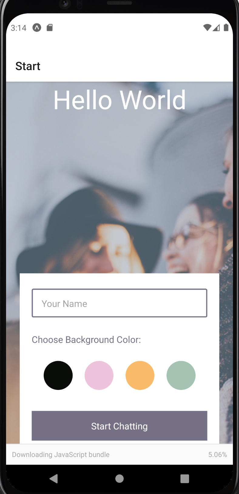

# Chat App
A Native Android "Chat" application using React Native, Expo, and Google Firestore Database. The app provide users with a chat interface and options to share images and their
location. 

*See the [Detailed Description](#detailed-description) below for more information*
<p align="center">

</p>

## Features
- A page where users can enter their name and choose a background color for the chat screen
before joining the chat.
- A page displaying the conversation, as well as an input field and submit button.
- The chat must provide users with two additional communication features: sending images
and location data.
- Data gets stored online and offline.

## Technical Specs

- React Native
- Developed using Expo
- Chat conversations stored in Google Firestore Database
- Users can pick and send images from the phone’s image library
- Users take pictures with the device’s camera app, and send it
- Images stored in Firebase Cloud Storage
- Read and send the user’s location data

## Detailed Description
The app was written in **[React Native](https://reactnative.dev/)**, a JavaScript framework for writing native applications for iOS and Android. A CLI tool, **[Expo](https://docs.expo.dev/)**, to set up and run the project. Testing on my computer was done using **[Android Studio](https://developer.android.com/studio)** as an Android emulator, and on my phone using the **[Expo Go app](https://expo.dev/client)**.

The chat screen’s layout, styling, and chat functionalities utilized **[Gifted Chat](https://github.com/FaridSafi/react-native-gifted-chat)**—a React Native library created specifically for developing chat apps. This library was used to create a chat interface, which includes a text input for typing messages and speech bubbles for sent and received messages.

**[Google Firebase’s Cloud Firestore database](https://firebase.google.com/products/storage/)**(a NoSQL database) allows for the app to have real-time data for messages and media.

***Real-time data*** (RTD) is information stored in a database that’s delivered to a user without delay, which is necessary for a chat app (another example is Google Docs, where multiple users can work within the same doc at the same time, and all updates made in that document are displayed instantaneously (i.e., in “real-time”).

As the Chat app utilizes **Cloud Firestore**, this not only handles the real-time connection between clients and the server, but also all the data storage (and data transfer) for the app. It basically provides the means for real-time data transfer between users and the database, allowing users to store and retrieve data in a streamlined and accessible way, without the developer having to write all the code from scratch. **Cloud Firestore** works by synchronizing data across multiple devices (iOS, Android, and web) and storing it in Firebase’s cloud.

Along with that, each message follows a format that’s accepted by **Gifted Chat** so there’s no need to manipulate or change anything when moving the data back and forth between the app and database. 

**[asyncStorage](https://github.com/react-native-async-storage/async-storage)** is used to give user offline access to their sent/received messages and **[NetInfo](https://docs.expo.dev/versions/latest/sdk/netinfo/)** is used to check whether or not the user is online. If the user is offline, the app will load and display the messages from **asyncStorage**, along with hiding the inputToolbar. If the user is online the app will authenticate the user via **Firebase**, load messages from **Firebase**, and save the new messages locally via **asyncStorage**.

Expo’s **[Permission API](https://docs.expo.dev/versions/v38.0.0/sdk/permissions/)**, **[ImagePicker API](https://docs.expo.dev/versions/latest/sdk/imagepicker/)**, and **[Location API](https://docs.expo.dev/versions/latest/sdk/location/)** are used to to ask the user to enable access to specific features like their camera, media, and location and then retrieve or access the corresponding native features or data on the device.

## Setting Up Expo and app

1. Node is required for installation
#### Install Dependencies
```
npm install
```
### Expo Set Up
2. Install the Expo Command Line Interface (CLI)
```
npm install expo-cli --global
```
3. Download the [Expo Go app](https://expo.dev/client) from the app store on your phone. The app icon should look something like this:
<p align="center">

</p>

4. Create an Expo account by heading over to the [Expo signup page](https://expo.io/) and follow the instructions to create an account. You should be able to log in to Expo from your browser and mobile app. Your expo app should look like this after logging in:
<p align="center">

</p>

## Run
1. Start the app in your terminal by running:
```
npm start
```
Or
```
expo start
```

2. Your browser will open a new window starting the metro bundler. Switch the connection type to "tunnel"
<p align="center">

</p> 

4. When the connection is ready, scan the QR code using the Expo Go app on your mobile device. The app should display the Start screen:
<p align="center">

</p> 
That's it! Have fun chatting :blush:
